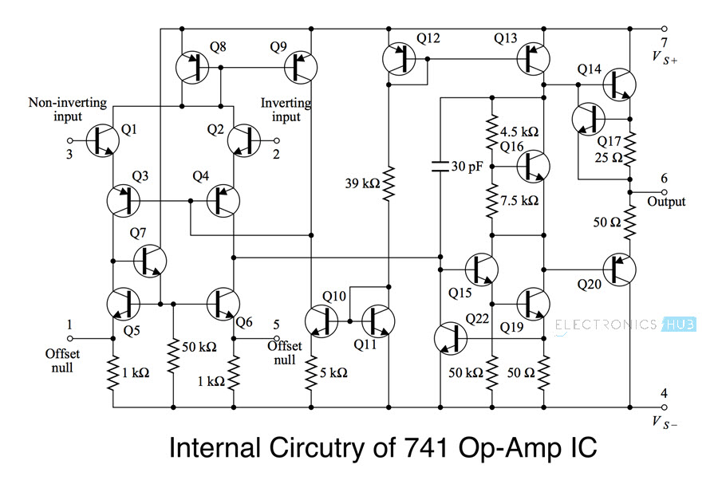

# Amplificador operacional 741 

Recreación del circuito interno del amplificador operacional 741 construido
a partir de transistores **2N3906**, **2N3904** y resistencias. 

## Original

## Board

## Schematic

## Componentes usados: 
- 11 Transistores NPN 2n3914
- 7 Transistores PNP 2n3906
- Resitencias:
    - 2 Resistencias de 50 KOhm 
    - 1 Resistencia de 39 KOhm
    - 2 Resistencias de 10 KOhm
    - 1 Resistencia de 5 KOhm
    - 1 Resistencia de 4.5 KOhm
    - 2 Resistencias de 1 KOhm
    - 2 Resistencias de 50 Ohm
    - 1 Resistencia de 25 Ohm
- capacitor cerámico 39uF
- Potenciómetro 10 kOhm

